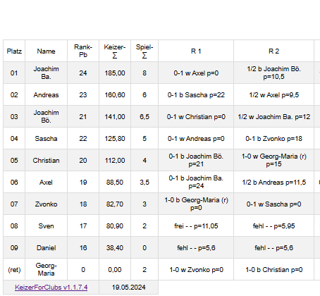

<br />

## KeizerForClubs

<br />

### Général

Le logiciel KeizerForClubs permet de gérer des tournois d'échecs utilisant le système Keizer jusqu'à 100 joueurs. 
<br />

### Comment se déroule un tournoi?

Les étapes essentielles en bref:

-   Ouvrez le programme, sélectionnez *Start...* dans le menu. Chaque tournoi est enregistré dans une petite base de données: ouvrez un fichier existant pour continuer un tournoi, choisissez un nouveau nom de fichier pour en commencer un nouveau.
-   Pour un nouveau tournoi, entrez les noms de tous les joueurs participants (si possible avec un classement élo, mais cela fonctionnera aussi sans).
-   Vous pouvez également inscrire des joueurs qui ne seront pas présents lors de la première ronde, mais qui joueront lors de rondes ultérieures du tournoi. Vous pouvez aussi ajouter de nouveaux joueurs en tout temps lors des rondes suivantes.
-   Avant d'apparier la première ronde ou la ronde suivante: définissez le statut de tous les joueurs (présents, excusés, etc.).
-   À présent, appariez la prochaine ronde: cela peut réalisé automatiquement par le programme ou manuellement.
-   Si nécessaire, créez des fichiers des listes: classement, appariements, liste actuelle des joueurs, etc.
-   Quitter le programme jusqu'à la prochaine ronde.

<br />

### Brève description de l'interface graphique

L'interface du programme est assez explicite, quelques lignes d'explication suffisent...

-   Pour commencer, un tournoi doit être créé avec *Start...*. Après, vous pourrez passer à un autre tournoi avec *Start...*.
-   Les trois onglets en bas de l'interface peuvent ensuite être sélectionnés (*Joueurs*, *Appariements*, *Paramètres*).
-   Pour ajouter des joueurs, il suffit d'inscrire leur nom et leur classement élo dans le tableau. Choisissez le statut dans la dernière colonne en cliquant sur *la flèche vers le bas* et sélectionnez une option dans la liste. L'ID est attribué automatiquement.
-   Pour apparier une nouvelle ronde, sélectionnez l'une des possibilités du menu *Appariements*. Les explications concernant l'appariement manuel se trouvent plus bas.
-   Le menu pour les appariements n'est actif que lorsque l'onglet des appariements est sélectionné.
-   Vous pouvez afficher et naviguer dans toutes les rondes jouées jusqu'à présent en utilisant les boutons fléchés haut/bas qui se trouvent à côté du numéro de la ronde.
-   Inscrivez les résultats des parties en les sélectionnant dans la liste (à nouveau en cliquant sur *la flèche vers le bas*).
-   Les résultats peuvent être corrigés à n'importe quel moment (lorsque, par exemple, *1-0* est saisi au lieu de *0-1*. Cela n'est nécessaire pour les joueurs qui se sont retirés du tournoi).
-   Le menu *Listes* permet d'exporter des fichiers du classement, des appariements, etc.

<br />

### Explications pour la fenêtre *Appariements manuels*

L'option du menu ouvre une nouvelle fenêtre avec, à gauche, la liste des noms de tous les joueurs disponibles (c'est-à-dire des joueurs dont le statut a été défini sur "Présent" auparavant) et, à droite, un *tableau vide*.

-   Cliquez sur un nom de joueur dans la liste de gauche puis sur une cellule vide du tableau à droite: le nom du joueur s'inscrit dans cette *cellule*.
-   Cliquez dans une cellule contenant déjà le nom d'un joueur: le nom du joueur est renvoyé dans la liste de gauche et la cellule redevient vide.
-   Cliquez sur le bouton "OK" pour enregistrer les appariements. Ils seront vérifiés avant d'être acceptés.
-   Si le nombre de joueurs est impair, la liste des noms des joueurs à gauche doit contenir à la fin seulement le nom du joueur qui doit obtenir le bye. *Chaque ligne* du tableau de droite dont contenir les noms de deux joueurs (ou d'aucun joueur).

<br />

### Description de quelques scénarios particuliers

#### Pas d'ordinateur dans la salle de jeu?

Dans ce cas, le directeur du tournoi déterminera les appariements pour la ronde en utilisant le classement actuel du tournoi. Les règles pour les appariements sont expliquées plus bas. Ensuite, les résultats de la ronde pourront être entrés dans le logiciel en utilisant *l'appariement manuel*.

#### Nouveaux joueurs entrant dans un tournoi en cours

Il suffit juste d'ajouter leurs noms dans la liste des joueurs: ces nouveaux joueurs seront immédiatement pris en compte pour les appariements des rondes suivantes et dans le classement du tournoi.

#### Joueurs qui se retirent du tournoi

Mettez le statut de ces joueurs sur *Retiré*.

Ces joueurs ne seront plus pris en compte pour les appariements et le classement du tournoi. Les adversaires de ces joueurs retirés reçoivent un bonus pour leurs parties jouées contre eux.

Le statut des joueurs retirés peut être remis à actif (présent) à n'importe quel moment.

Si un joueur renonce à participer au tournoi avant le début de la première ronde, vous pouvez mettre son statut sur *Effacer* et il sera alors complètement supprimé de la liste des joueurs.

#### Règles pour les appariements

-   L'appariement d'une ronde se fait en fonction des joueurs présents.
-   Parcourez le classement du tournoi du premier au dernier: le premier classé affronte le 2e, le 3e affronte le 4e et ainsi de suite.
-   Le classement du tournoi est établi par ordre décroissant des points Keizer. Pour la première ronde, ce sont les points de classement élo des joueurs qui sont utilisés.
-   La distribution des couleurs doit être *équitable*: le joueur qui a jusqu'ici joué avec le moins de fois avec les Blancs joue avec les Blancs.
-   Si les deux joueurs ont eu un même nombre de fois les Blancs et qu'ils ont déjà joué l'un contre l'autre lors d'une ronde précédente, alors les couleurs sont inversées par rapport à cette partie précédente, sinon les Blancs sont attribués au joueur le moins bien classé dans le tournoi. 
-   Contrairement au système suisse, la même couleur peut être attribuée à un joueur trois fois de suite.
-   Si un nombre impair de joueurs est présent, le joueur le moins bien classé reçoit un bye.
-   Options:
    -   Le bye peut être attribué à l'avant-dernier joueur le moins bien classé, etc. afin d'éviter qu'un même joueur reçoive deux fois le bye. En outre, un joueur qui a manqué une ronde ne recevra pas de bye avant que tous les autres joueurs aient reçu un bye ou manqué une ronde.
    -   Les mêmes appariements peuvent être répétés après n rondes.

<br />

### Les paramètres

Dans le système Keizer, il est également possible d'obtenir des points lorsqu'on ne joue pas. Le nombre de points varie en fonction de la raison de l'absence. Pour le calcul, on considère que vous jouez contre vous-même en utilisant un coefficient en pourcentage. 100% correspondent à une victoire, 50% à un match nul et 0% à une défaite.

Les valeurs en pourcentage peuvent être choisies dans l'onglet des paramètres. Par défaut, les valeurs suivantes sont définies:

-   70% en cas d'absence en raison *d'un engagement pour le club*.
-   35% pour une absence excusée.
-   35% pour une absence non excusée.
-   75% pour les parties contre des joueurs qui se sont retirés.
-   50% pour un bye.

#### Bonus de difficulté

Dans KeizerForClubs, vous pouvez obtenir une fraction de points pour avoir joué, même si vous perdez. Vous obtenez le bonus de difficulté multiplié par le nombre de Keizer-Rank-Points de votre adversaire si vous perdez une partie. Je recommande des valeurs de 2 à 5 %.  

*Raisonnement*

1. Une défaite toujours égale à 0 semble un peu injuste, parce que si vous perdez contre le vainqueur du tournoi, cela signifie quelque chose de différent que si vous perdez contre le dernier du tournoi. 
C'est pourquoi, dans le système suisse, il existe ce que l'on appelle en allemand *Buchholz*, en anglais *SOS* ou *sum of opponent scores*, en français *SPA* ou *somme des points des adversaires*. C'est la somme de tous les points de vos adversaires. Vous obtenez plus de *SPA* si vous avez perdu contre le vainqueur que si vous avez perdu contre le dernier. Le bonus de difficulté est l'équivalent pour KeizerForClubs de *Buchholz*, *SOS* ou *SPA*.

2. Avec le système Keizer, les joueurs qui ne jouent pas peuvent obtenir un nombre considérable de points. Cela semble injuste pour ceux qui jouent et perdent, car les perdants obtiennent toujours zéro, alors que les évitants obtiennent toujours des points.

<br />

### Explication des options

#### \# rondes avant répét. appariement

Il s'agit du nombre minimum de rondes avant que deux joueurs puissent s'affronter à nouveau.

*   0 signifie que deux joueurs peuvent être de nouveau appariés ensemble lors de la ronde suivante.
*   99 (ou tout autre nombre élevé) garantit que deux joueurs ne se rencontreront qu'une seule fois durant tout le tournoi.
*   Si un tournoi comporte 7 rondes et que ce nombre est fixé à 2, il se peut que certains mêmes appariements se répètent trois fois dans le tournoi, à savoir aux 1re, 4e et 7e rondes.

#### Distribuer le bye équitablement
Si cette option n'est pas activée, le bye est toujours attribué au joueur le moins bien classé du tournoi lorsqu'un nombre impair de joueurs se présente à une ronde.

#### Degré d'aléatoire pour la première ronde
Dans le système Keizer, l'appariement de la première ronde est à chaque fois identique avec les mêmes joueurs au départ. Cela peut être gênant pour des tournois dans des petits clubs où ce sont toujours les mêmes joueurs qui jouent les tournois. Lorsque cette valeur est réglée sur un nombre différent de 0, l'attribution des couleurs lors de la première ronde devient aléatoire et un nombre aléatoire compris entre 0 et la valeur est ajouté ou soustrait du classement élo de chaque joueur pour déterminer les appariements de la première ronde.

#### Ratio du gain entre 1er et dernier

Dans le système Keizer, une victoire contre le joueur classé premier du tournoi rapporte plus de points qu'une victoire contre les autres joueurs.

Cette valeur correspond aux points que vous obtiendriez pour une victoire contre le joueur le mieux classé du tournoi, divisés par les points que vous obtiendriez contre le joueur le moins bien classé du tournoi. Plus ce chiffre est petit, plus le système Keizer et le système suisse sont proches. 3 est la valeur par défaut. Plus le chiffre est élevé, plus les joueurs les mieux classés du tournoi se distinguent des autres. Je recommande des valeurs plus basses pour les tournois de moins de 20 joueurs.

#### Normalisation de la victoire


Si cette case est cochée, tous les points Keizer sont normalisés de sorte qu’une victoire contre le 
dernier du classement compte pour 1 point Keizer. Cela ne change rien au calcul du classement ou 
de l’appariement, mais cela rend les points Keizer beaucoup plus faciles à comprendre.

(Dans le système Keizer original, les points Keizer attribués sont généralement de grands nombres entiers. 
Cela a probablement été fait à l’origine dans le but de faciliter les calculs. 
En effet, il est plus facile de calculer avec des nombres entiers si l’on n’a pas d’ordinateur.

De nos jours cependant, tous les calculs sont effectués par ordinateur et nous pouvons par 
conséquent utiliser des nombres beaucoup plus petits sous forme fractionnaire.)


<br />

### Menu Listes
En sélectionnant une entrée dans le menu des listes, des fichiers de sortie seront générés dans le dossier _export_. Le type de sorties à générer peut être sélectionné dans l'onglet _Paramètres_.

#### Sortie HTML
Le fichier HTML se compose de styles CSS généraux qui sont les mêmes pour tous les tableaux et de code HTML qui contient les données réelles.
Les styles CSS se trouvent dans le fichier _export/keizer.css_. Vous pouvez modifier les styles CSS pour les adapter à vos besoins si vous le souhaitez.

Les tableaux de données contiennent les balises suivantes, où les éléments entre _{}_ seront remplacés par les données réelles :
```
id='kfc-{tournament name}-{table type}-{current round}'
class='my-wrapper kfc-wrapper kfc-wrapper-{number of columns}'
/* La grille américaine peut devenir très large, c'est pourquoi elle est construite avec des styles CSS différents: */ 
class='my-exwrapper kfc-exwrapper kfc-exwrapper-{number of columns}'
```

#### Détails de la grille américaine 

##### Rank-Pb

La colonne _Rank-Pb_ signifie « Keizer-*Rank*-*P*oints *b*efore la ronde actuelle ». Si vous passez la souris sur l'en-tête de la colonne du fichier HTML, vous verrez une infobulle.

Je vais essayer d'expliquer.

Les points Keizer qu'un joueur A obtient pour une victoire contre le joueur B correspondent à cette valeur Rank-Pb. J'ai introduit cette colonne pour permettre de recalculer manuellement les points Keizer. Des questions ont en effet été posées par mes camarades de club...

Cf. la capture d'écran ci-dessous, qui est une partie d'un tableau d'un tournoi.

Vous voyez par exemple que le Rank-Pb du joueur 4 (Sascha) est de 22. Cela signifie que dans la ronde précédente, la position occupée par Sascha dans le tableau correspondait à une valeur de 22 Keizer-Rank-Points. Cela signifie que vous obtenez 22 points pour chaque victoire contre Sascha. Et comme Andreas a gagné contre Sascha lors de la première ronde, il a obtenu 22 Keizer-Points pour cette victoire. Ce que vous pouvez voir dans le tableau sous R1.

Un autre exemple : Le Rank-Pb du joueur 2 (Andreas) est de 23. Par conséquent Axel (le joueur 6), qui a fait match nul lors de la 2e ronde contre Andreas, 
a obtenu 11,5 points Keizer pour ce match nul (11,5 = 23 / 2).



<br />

### Menu Joueurs

#### Importer des joueurs
Il est possible d'importer une liste de joueurs au format csv. Le nom et le classement du joueur sont importés. 
Le format du fichier csv est déterminé par la première ligne du fichier. Dans la première ligne, les séparateurs (point-virgule, deux-points ou virgule), 
le texte _Name_ et le texte _Rating_. Le reste du fichier est lu en fonction du format de la première ligne. 
Exemple : la première ligne du fichier csv est 
```
x;x;;xxx;Name;;Rating
``` 
Ensuite, le séparateur est le point-virgule, les noms des joueurs sont dans la 5e colonne, les ratings des joueurs sont dans la 7e colonne. 

#### Effacer tous
Supprime tous les joueurs. Ceci est utile si vous voulez créer un tournoi B qui aura exactement les mêmes paramètres que le tournoi A précédent. 
Dans ce cas, copiez A.s3db vers B.s3db, puis effacez toutes les rondes jouées, puis effacez tous les joueurs. 
Pour s'assurer que vous ne supprimez pas accidentellement votre tournoi actuel, la suppression de tous les joueurs n'est possible que s'il n'y a pas de parties dans la base de données.   

#### Joueur Ids réattrribué
Après avoir importé une liste de joueurs, par exemple les membres du club, puis supprimé les joueurs qui ne participent pas au tournoi, la liste des joueurs peut être 
dans KeizerForClubs présente de nombreux trous dans l'ordre des numéros de joueurs. C'est un peu agaçant. 
D'autant plus que l'Id de joueur le plus élevé ne permet pas de savoir combien de participants participent au tournoi.  
Vous pouvez utiliser _Joueur Ids réattrribué_ pour supprimer les trous dans l'ordre des Id. Possible uniquement au début d'un tournoi. 

<br/> 

### Système Keizer et Système Suisse

#### Comparaison des systèmes d'appariement Keizer et Suisse

<style>
th, td {
    padding: 5px;
}
tr:hover {background-color: coral;}
tr:nth-child(odd) {background-color: #f2f2f2;}
</style>

<table style="max-width: 800px">
<colgroup>
<col span="1" style="width: 20%;">
<col span="1" style="width: 40%;">
<col span="1" style="width: 40%;">
</colgroup>
<tr><th>Propriété</th><th>Keizer</th><th>Suisse</th></tr>
<tr><th>L'appariement </th><td>se fait généralement peu de temps avant que la manche ne soit jouée.</td><td>peut se faire des jours ou des semaines avant que la manche ne soit jouée.</td></tr>
<tr><th>Les joueurs forts sont opposés les uns aux autres</th><td>dès le premier tour.</td><td>seulement plus tard.</td></tr>
<tr><th>Le joueur n'a pas d'adversaire</th><td> Parce que l'appariement est fait peu de temps avant le tour, cela n'arrive pas souvent.</td><td>Peut arriver souvent.</td></tr>
<tr><th>Points pour la victoire</th><td>Plus de points pour les victoires contre de meilleurs joueurs.</td><td>Un point pour chaque victoire, 
  plus une évaluation fine comme *somme des points de l'adversaire* ou SPA.</td></tr>
<tr><th>Points pour la défaite</th><td>Dans le Keizer original, juste zéro. Dans KeizerForClubs, il est possible d'attribuer un bonus de solidité.
Cela remplace l'évaluation de l'amende SPA en Suisse. </td><td>Zéro, mais compte pour l'évaluation SPA fine.</td></tr>
<tr><th>Gestion des couleurs </th><td>La couleur ne joue aucun rôle dans l'appariement.  Celui qui avait relativement moins de blanc obtient le blanc. En pratique, la différence avec la gestion suisse des couleurs est marginale.</td><td>Idéalement, chaque tour est différent pour chaque joueur, personne n'obtient jamais trois fois la même couleur à la suite.  Cette règle est appliquée lors de l'appariement. </td></tr>
<tr><th>Les joueurs manquants</th><td> obtiennent généralement des fractions de points. </td><td> Un ou deux *bye-draws* sont souvent autorisés. </td></tr>
<tr><th>Jeux contre des joueurs démissionnaires</th><td>Un traitement spécial est utilisé.</td><td>Les résultats peuvent être annulés pour une évaluation fine.</td></tr>
<tr><th>Le même adversaire au tour suivant</th><td>peut être autorisé.</td><td>n'est jamais autorisé.</td></tr>
<tr><th></th><td></td><td></td></tr>
</table>

#### Systèmes hybrides Keizer-Swiss

On peut imaginer de nombreux systèmes hybrides Keizer-Swiss différents. Avec KeizerForClubs, vous pouvez en créer un grand nombre. 

Par exemple :

* Une victoire contre n'importe qui compte pour un point plus une évaluation fine. Similaire à Swiss.
* Les couleurs sont gérées comme dans Keizer.
* Les joueurs qui ne sont pas là peuvent obtenir des fractions de points comme à Keizer ou en Suisse avec les bye.
* Les joueurs qui ont des parties contre des joueurs résignés obtiennent des points complets comme en Suisse.
* En principe, un joueur peut jouer deux fois contre un autre, comme à Keizer - ou pas, comme en Suisse. Ceci peut être entièrement géré
par le directeur du tournoi en augmentant le paramètre « # rounds rondes avant repet. » 


<br/>

### Remerciements

*   Le programme a été développé à l'origine avec SharpDevelop, mais j'utilise à présent Microsoft Visual Studio Community 2022. 
*   La base de données est [SQLite](https://www.SQLite.org).
*   Le logiciel est hébergé sur [Github](https://github.com/Dumuzy/KeizerForClubs/releases). 

Remerciements particuliers à

*   Thomas Schlapp pour le développement initial de ce logiciel.
*   Jürgen Kehr pour ses tests et ses autres précieuses informations.
*   Pascal Golay pour ses tests, discussions et la traduction en français. 

### Licence

Le programme est mis à disposition gratuitement. Il est fourni sans aucune garantie; l'utilisation se fait à ses propres risques et périls. Cf. aussi le fichier License.txt.

